# 🧠 Hand Gesture Controlled Vehicle

This project implments a hand gesture based robotic vehicle controlled wirelessly using a glove-mounted MPU6050, RF communication, and Arduino microcontrollers. Hand tilt and orientation are mapped to predefined motion commands for vehicle navigation.

---

## 🚀 Project Overview  
This project focuses on developing a human–machine interface for controlling a robotic vehicle using hand gestures. A wearable transmitter unit mounted on a hand glove captures hand orientation using a 3-axis accelerometer and gyroscope (MPU6050). The sensed data is processed by an Arduino Uno and transmitted wirelessly using RF modules to a receiver unit mounted on the robotic vehicle.

The receiver interprets the transmitted data and drives DC motors through a motor driver to perform movements such as forward, backward, left, right, diagonal turns, and stop. Additional safety and utility features include ultrasonic obstacle detection and an automated rain-sensor-based wiper system.

---

## ✋ Problem Statement  
Traditional robotic vehicles are commonly controlled using physical interfaces such as joysticks, remotes, or wired controllers. These interfaces can be inconvenient, unintuitive, or unsuitable for users with physical limitations.

The problem addressed in this project is to design a simple, low-cost, and intuitive control mechanism that allows a robotic vehicle to be operated using natural hand movements without physical controllers.

---

## 🧩 Dataset (if any)  
No dataset was used in this project.  
The system operates entirely on real-time sensor data captured from the MPU6050 accelerometer and gyroscope mounted on the hand glove.

---

## 🏗️ Model Architectures  
This project does **not** use machine learning or deep learning models.

The system follows a **rule-based, threshold-driven architecture**:

- MPU6050 captures raw acceleration values along X, Y, and Z axes  
- Raw sensor values are scaled using a fixed sensitivity factor (16384 LSB/g)  
- Predefined threshold ranges determine gesture direction  
- Each gesture is encoded into a 3-bit command  
- Commands are transmitted via 433 MHz RF modules  
- Receiver decodes commands and controls motors using L293D motor driver  

## 🔹 **Strength:**  
- Deterministic and explainable control logic  
- No training or dataset dependency  
- Suitable for real-time execution on low-resource hardware  

---

## 📊 Quantitative Results  
- Five primary gestures successfully recognized (forward, backward, left, right, stop)  
- Additional diagonal movements implemented using combined axis thresholds  
- Reliable RF communication achieved for short-range operation  
- Ultrasonic sensor successfully applied automatic braking at ~70 cm distance  

---

## 📊 Interpretation  
The results confirm that MPU6050-based hand gestures can reliably control a robotic vehicle using simple threshold logic. The system responds consistently under controlled conditions, with predictable motion corresponding to hand orientation.

Performance is stable for predefined gestures, though accuracy is dependent on proper sensor calibration and environmental conditions.

---

## 🧠 Critical Insights  
- MPU6050 orientation alone is sufficient for basic gesture control  
- Threshold selection directly affects responsiveness and stability  
- RF communication introduces minor latency but remains acceptable  
- Sensor-based systems are simpler to implement than vision-based alternatives for embedded platforms  

---

## 📂 Project Structure (High-Level)

```
Hand gesture/
│
├── RCVGestures/ # Gesture logic and related files 
├── RCVRain_Sensor/ # Rain sensor and wiper control
├── RCVResults_Images/ # Experimental results and hardware images
├── RCVSimulation_Video/ # Demonstration video
├── RCVFYP_RunningCode.txt # Transmitter and receiver logic
├── RCVNew_code.txt # Supporting code
├── RCV_ExtThesis.pdf # Full thesis documentation
├── RCV_External_Presentation_RCV_RCV.pptx
└─README.md

```

---

## 📸 Result's Screenshots  

**Hardware Setup**
<p align="center">  <br> <em>Figure 1: Final transmitter unit mounted on hand glove (MPU6050 + RF module)</em> </p> <p align="center"> 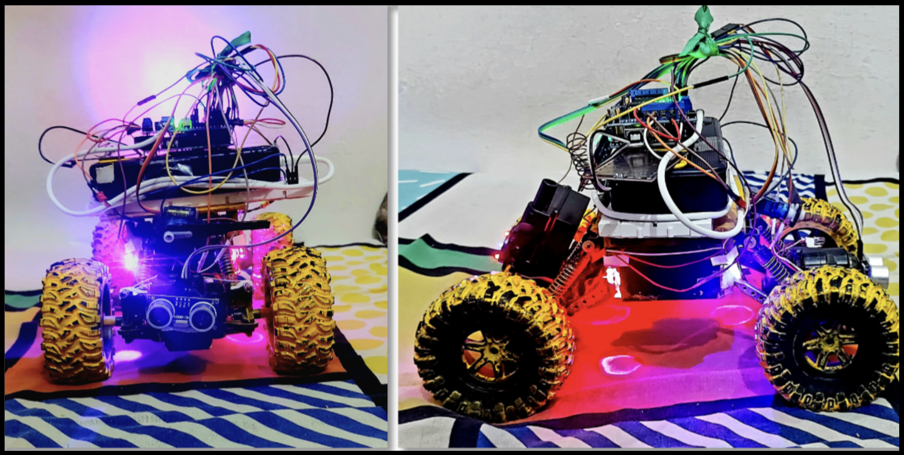 <br> <em>Figure 2: Final robotic vehicle receiver unit</em> </p>

**Transmitter & Receiver Circuits**
<p align="center"> 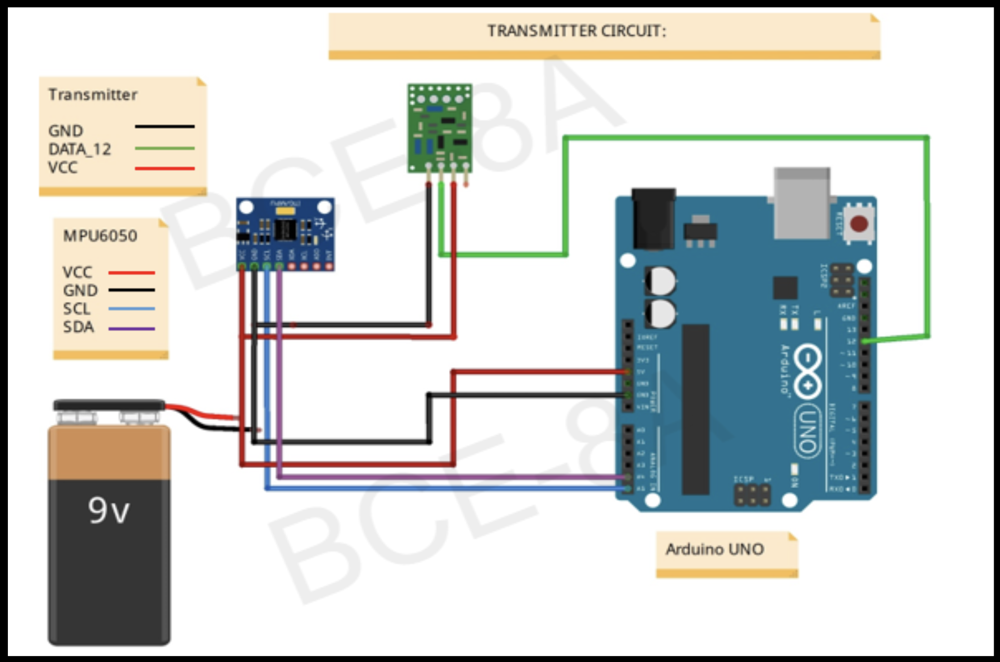 <br> <em>Figure 3: Transmitter circuit (MPU6050, Arduino, RF transmitter)</em> </p> <p align="center"> 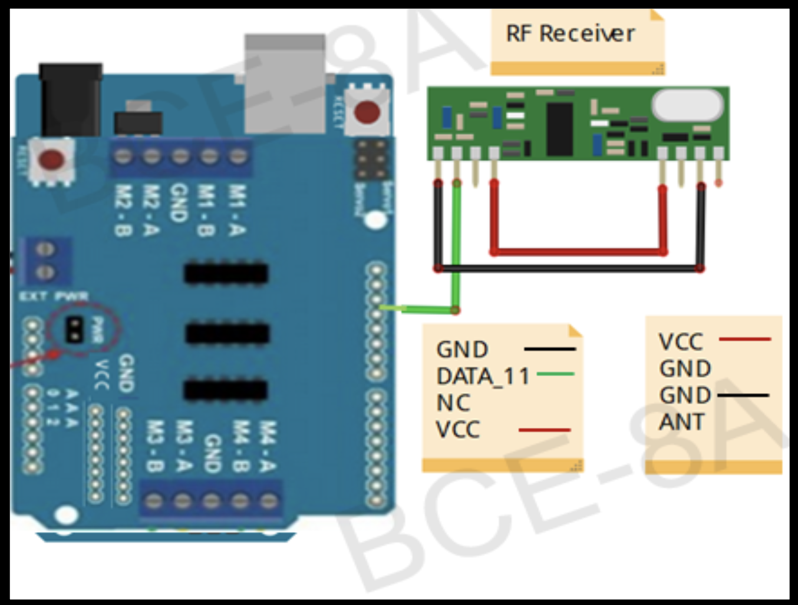 <br> <em>Figure 4: Receiver end hardware configuration</em> </p> <p align="center"> 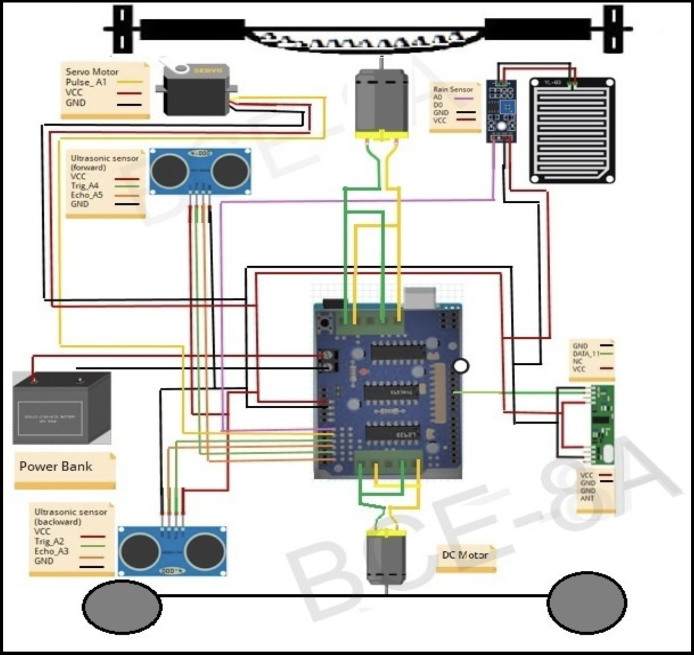 <br> <em>Figure 5: Complete robotic vehicle circuit diagram</em> </p>

**Gesture-Based Vehicle Movements**
<p align="center">  <br> <em>Figure 6: Forward and backward movement based on hand gesture</em> </p> <p align="center"> 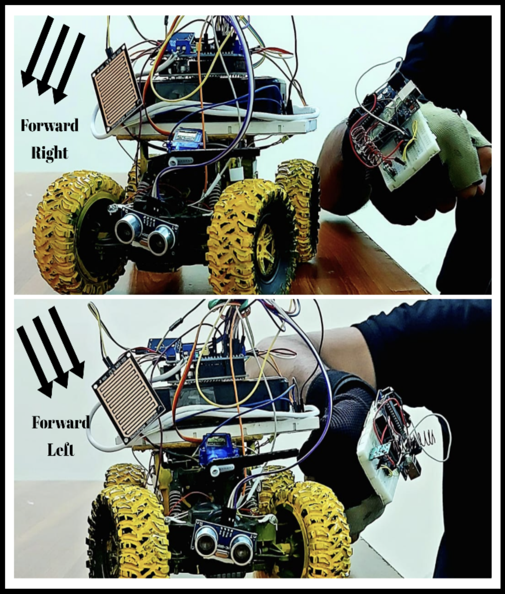 <br> <em>Figure 7: Forward right and forward left movements</em> </p> <p align="center"> 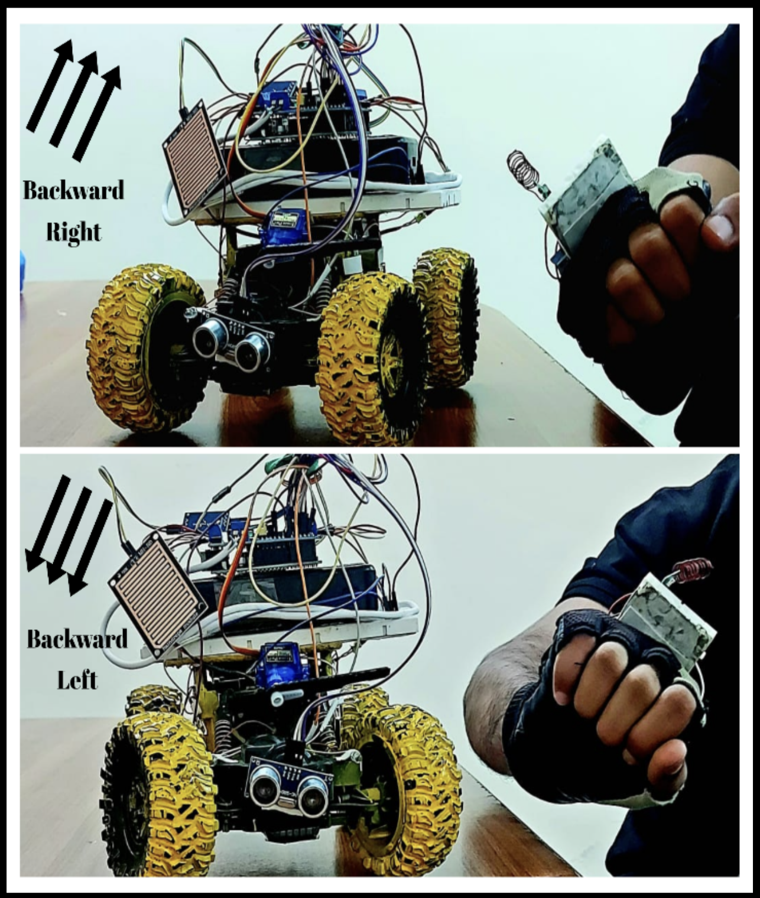 <br> <em>Figure 8: Backward right and backward left movements</em> </p> <p align="center"> 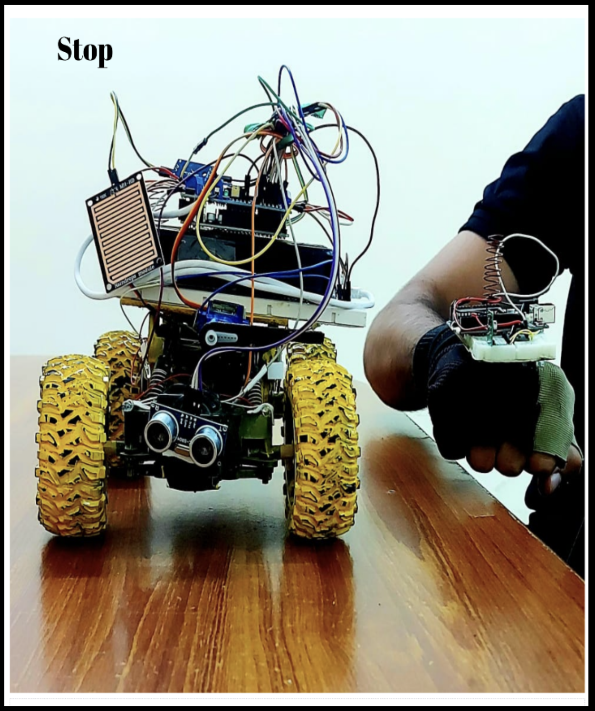 <br> <em>Figure 9: Stop condition using neutral hand position</em> </p>

**Safety & Auxiliary Features**
<p align="center"> 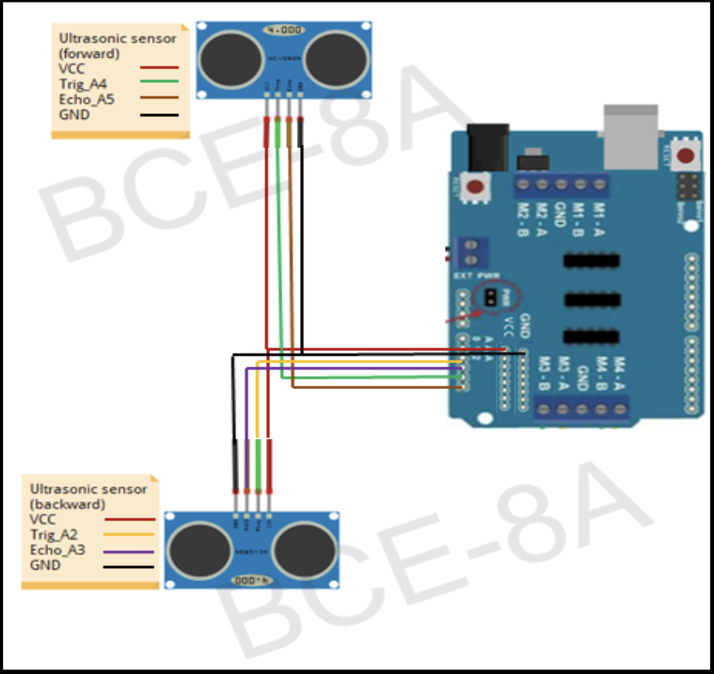 <br> <em>Figure 10: Ultrasonic sensor circuit for obstacle detection and automatic braking</em> </p> <p align="center"> 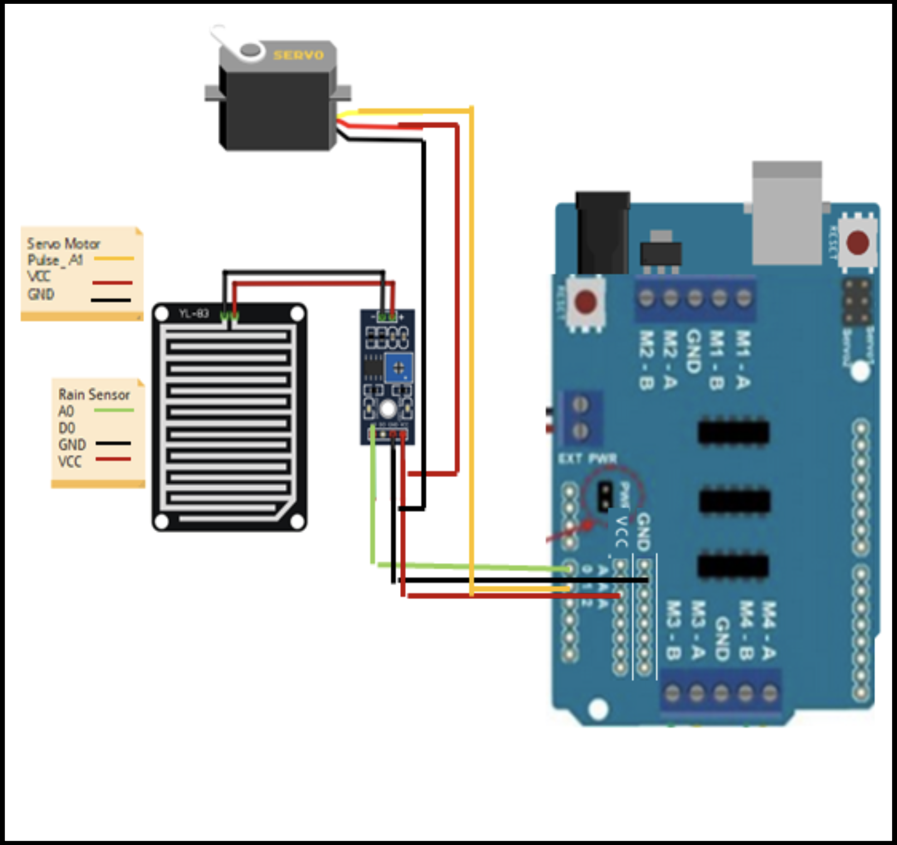 <br> <em>Figure 11: Rain sensor and servo motor circuit for automatic wiper control</em> </p>

**System Logic & Flowcharts**
<p align="center"> 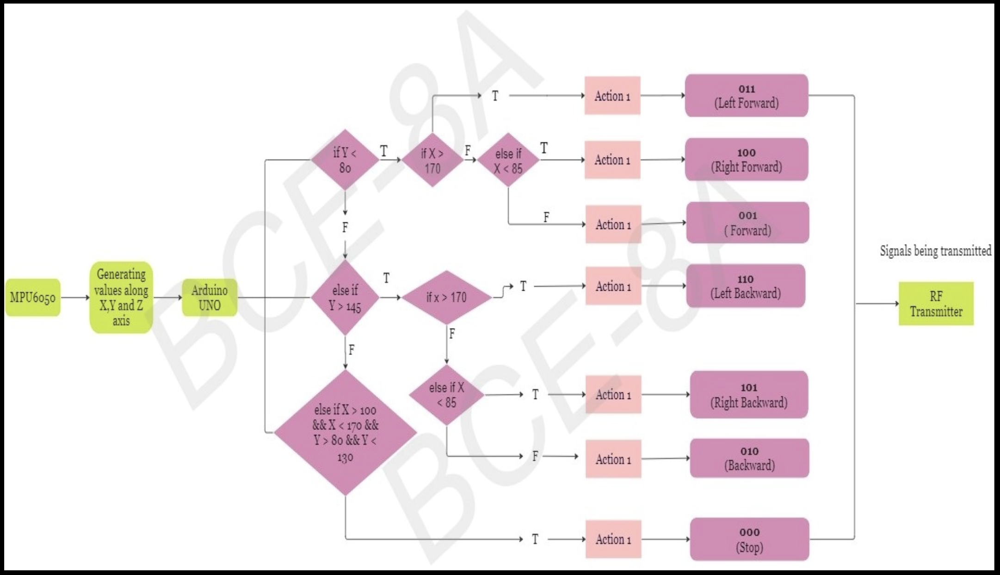 <br> <em>Figure 12: Transmitter-side logic and gesture processing flow</em> </p> <p align="center"> 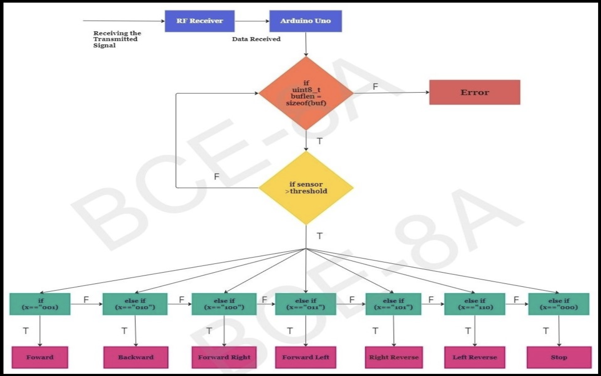 <br> <em>Figure 13: Receiver-side logic and motor control flow</em> </p>

---

## ▶️ System Demonstration Videos

**Vehicle Movement Demonstratio**
<p align="center">
  <a href="Simulation_Video/Vehicle_Movement_small.mp4">
    
  </a>
  <br>
  <em>Click image to watch complete system demonstration</em>
</p>


**Complete System Demonstratio**
<p align="center">
  <a href="Simulation_Video/Complete_small.mp4">
    
  </a>
  <br>
  <em>Figure 14: Click image to watch complete system demonstration</em>
</p>

---

## ▶ ️ How to Run the Project  
1. Assemble the transmitter unit with MPU6050, Arduino Uno, and RF transmitter  
2. Assemble the receiver unit with RF receiver, Arduino Uno, L293D motor driver, and motors  
3. Upload transmitter and receiver code using Arduino IDE  
4. Power both units  
5. Perform predefined hand gestures to control the vehicle  

---

## 🔭 Current Limitations & Future Work  

**Limitations:**  
- Performance affected by improper sensor calibration  
- Limited to predefined static gestures  
- Sensitive to abrupt hand movements  

**Future Work:**  
- Integration of vision-based gesture recognition  
- Addition of Bluetooth or Wi-Fi communication  
- Voice-based control integration  
- Expansion to military, medical, or agricultural applications  

---

## 🎓 Intended Audience  
- Undergraduate engineering students  
- Robotics and embedded systems learners  
- Researchers studying human–robot interaction  

---

## 📚 Citation & Usage  
This project is intended for academic and educational use.  
If referenced, please cite the thesis included in this repository.

---

## 👤 Author  
Muhammad Ahmed  
BS Computer Engineering  
Department Topper 🏅
COMSATS University Islamabad (Abbottabad Campus)  
Spring 2023

---

## ⭐ Feedback & Contributions  
   Suggestions for improvement and academic discussion are welcome.
⭐ If you find this project useful, consider starring the repository.
